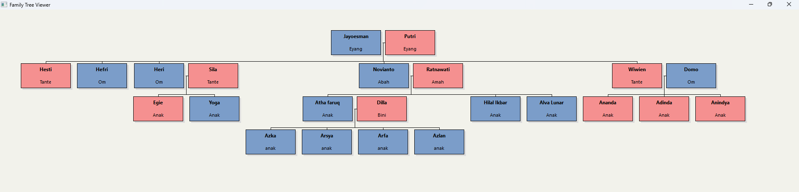

# Program Silsilah Keluarga (Family Tree Viewer)

Aplikasi ini adalah program desktop berbasis C++ yang memvisualisasikan struktur silsilah keluarga secara grafis. Program membaca data dari file eksternal (`Family.csv`) dan menggambarkannya sebagai diagram pohon interaktif. 

##  Data Mahasiswa

*   **Nama:** Muhammad Hilal Ikbar
*   **NIM:** 125103053
*   **Kelas:** Kelas C

---

##  Fitur Utama

1.  **Visualisasi Grafis Menarik:** 
    Program tidak menggunakan output teks terminal biasa, melainkan menggunakan **Win32 API (GDI)** untuk menggambar diagram:
    *   Kotak berwarna **Biru** untuk Laki-laki.
    *   Kotak berwarna **Merah Muda (Pink)** untuk Perempuan.
    *   Garis penghubung otomatis antar orang tua dan anak.

2.  **Live Reload (Real-time):** 
    Fitur canggih di mana program memantau file `Family.csv`. Jika Anda mengedit dan menyimpan file CSV saat program berjalan, tampilan silsilah akan **diperbarui secara otomatis** tanpa perlu restart aplikasi.

3.  **Navigasi Scroll:** 
    Mendukung scroll bar (vertikal dan horizontal) sehingga mampu menampilkan silsilah keluarga yang sangat besar/luas.
##  Struktur File

*   `main.cpp`: Kode sumber (source code) utama. Berisi logika pembacaan file, struktur data `Person`, algoritma layout, dan rendering grafis Windows.
*   `Family.csv`: Database keluarga dalam format teks sederhana.
*   `sisilah.cbp`: File project untuk dibuka di IDE **Code::Blocks**.

##  Cara Menggunakan

### 1. Compile & Run
Project ini dikembangkan menggunakan **Code::Blocks**.
1.  Buka file `sisilah.cbp`.
2.  Build & Run project (Tekan F9).
3.  Jendela aplikasi akan muncul.

### 2. Mengubah Data Keluarga
Data keluarga disimpan di file `Family.csv`. Anda bisa mengeditnya menggunakan Excel, Notepad, atau VS Code.

**Format Kolom:**
`ID, Nama, Peran, Gender, ID_Ayah, ID_Ibu, ID_Pasangan`

**Contoh Data:**
```csv
1,Jayoesman,Eyang,M,0,0,2
2,Putri,Eyang,F,0,0,1
15,Hesti,Tante,F,1,2,0
```
*   **ID:** Nomor unik untuk identifikasi (Wajib angka).
*   **Gender:** `M` (Male/Laki-laki) atau `F` (Female/Perempuan).
*   **Orang Tua (Ayah/Ibu):** Isi dengan `ID` ayah/ibu. Jika tidak ada data (misal leluhur teratas), isi dengan `0`.
*   **Pasangan:** Isi dengan `ID` suami/istri. Pisahkan dengan `|` jika lebih dari satu.

##  Screenshot Hasil Output




---
